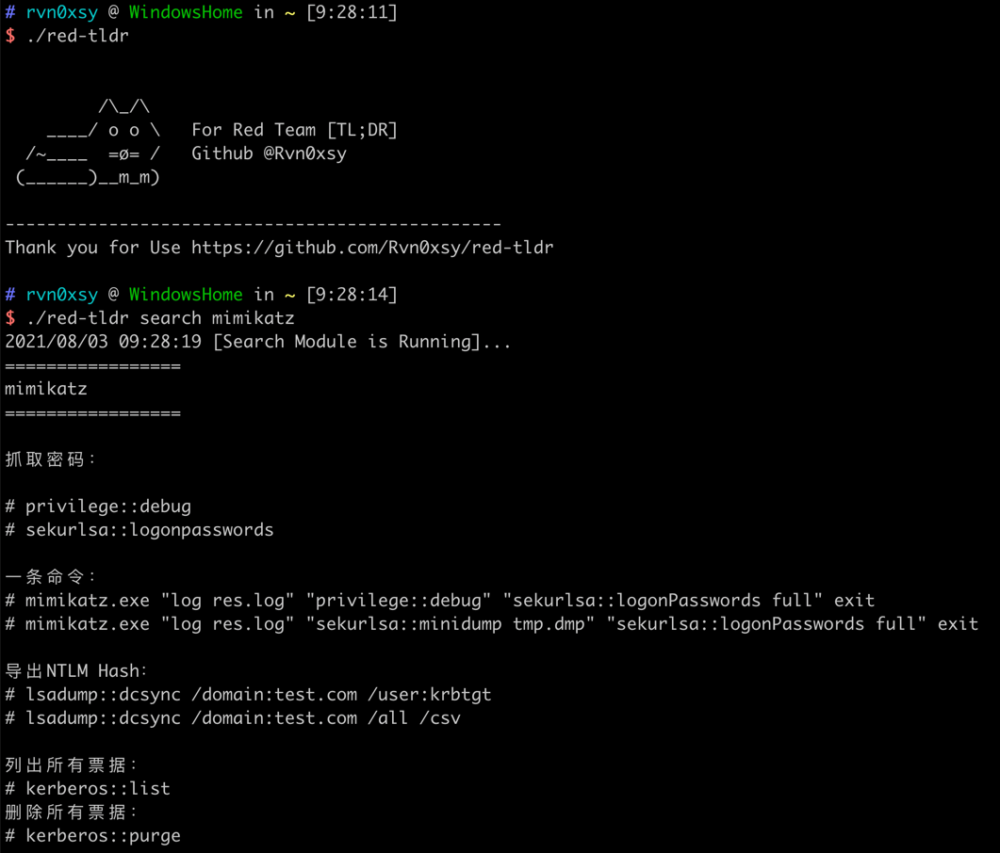
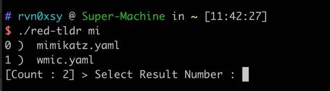
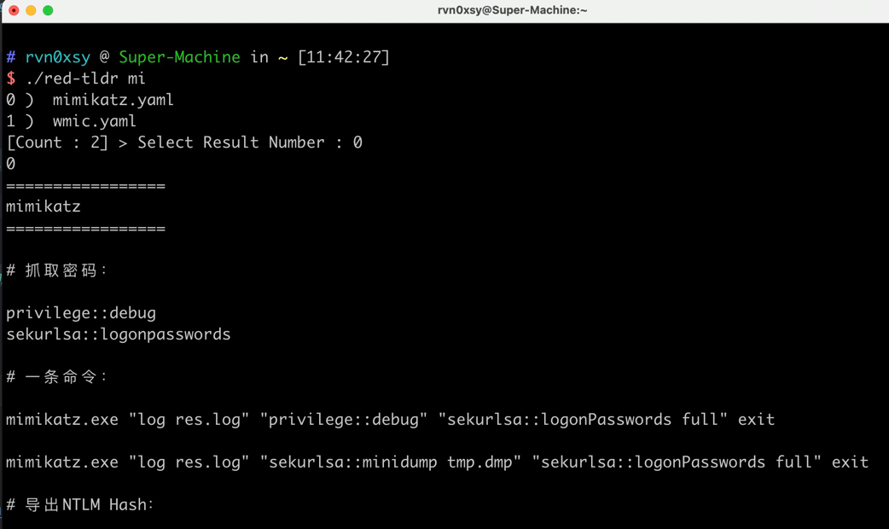

# Red Team TL;DR

[English](./README.md) | [中文简体](./README-zh.md)

[](https://github.com/Rvn0xsy/red-tldr/releases)

## 什么是 Red Team TL;DR ?

red-tldr 是一个轻量级的文本搜索工具，它用于帮助红队工作人员快速的寻找到想要执行的命令、关键点，因此它比较适用于有一定经验的红队人员使用。

## 为什么选择 Red Team TL;DR ?

在我的日常工作中，需要记忆很多命令，我多数只知道它的开头，人的记忆是有限的，而通过搜索引擎寻找我想要的内容又很繁琐，我想我们需要一个像Linux那样的`man`命令。


## 快速开始

> **新版本已经支持自动更新数据库！**

### 安装 red-tldr

#### Mac OS 安装

```bash
$ brew install red-tldr
```

#### Git安装

```bash
$ git clone https://github.com/Rvn0xsy/red-tldr
$ cd red-tldr
$ go build
```

#### Arch Linux 安装

```bash
# yaourt 或者 yay https://aur.archlinux.org/packages/red-tldr
$ sudo pacman -S red-tldr 
```


#### 二进制安装


下载 [Release](https://github.com/Rvn0xsy/red-tldr/releases/) 版本。

```bash
$ tar -zxvf red-tldr_latest_linux_amd64.tar.gz
$ ./red-tldr
```

> 建议将red-tldr加入你的环境变量中进行使用


## 简单示例

1. 关键字搜索

```bash
$ red-tldr mimikatz
```



2. 模糊匹配

```bash
$ red-tldr mi
```



Select Number : 0

> 当存在多个结果时，可以跟进数字索引决定结果输出




3. 更新索引文件

```bash
$ red-tldr update
```

4. 更新数据库文件

```bash
$ red-tldr upgrade
```


## 配置文件

默认配置文件路径：`HOME/.red-tldr/config.toml`

```
[red-tldr]
  index-update = false
  github-update = false
  path = ""
  color = true
```

|    配置项   | 描述 |  类型  |
| ----------- | ----------- |  ----------- |
| index-update| 数据库索引文件是否自动更新   |   Bool |
| github-update   |  数据库文件是否从github自动更新 | Bool |
| path  | 数据库文件存放路径 | String |
| color | 高亮输出命令 | Bool |


## 贡献

## 为 red-tldr 做贡献

red-tldr 是一个免费且开源的项目，我们欢迎任何人为其开发和进步贡献力量。

* 在使用过程中出现任何问题，可以通过 [issues](https://github.com/Rvn0xsy/red-tldr/issues) 来反馈。
* Bug 的修复可以直接提交 Pull Request 到 dev 分支。
* 如果是增加新的功能特性，请先创建一个 issue 并做简单描述以及大致的实现方法，提议被采纳后，就可以创建一个实现新特性的 Pull Request。
* 欢迎对说明文档做出改善，帮助更多的人使用 red-tldr，特别是英文文档。
* 贡献代码请提交 PR 至 dev 分支，master 分支仅用于发布稳定可用版本。
* 如果你有任何其他方面的问题或合作，欢迎发送邮件至 rvn0xsy@gmail.com 。

**提醒：和项目相关的问题最好在 [issues](https://github.com/Rvn0xsy/red-tldr/issues) 中反馈，这样方便其他有类似问题的人可以快速查找解决方法，并且也避免了我们重复回答一些问题。**

## Stargazers over time

[](https://starchart.cc/Rvn0xsy/red-tldr)