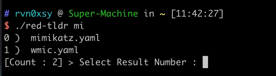

# Red Team TL;DR

[English](./README.md) | [中文简体](./README-zh.md)

[](https://github.com/Rvn0xsy/red-tldr/releases)

## What is Red Team TL;DR ?

red-tldr is a lightweight text search tool, which is used to help red team staff quickly find the commands and key points they want to execute, so it is more suitable for use by red team personnel with certain experience.

## Why Red Team TL;DR ?

In my daily work, I need to memorize a lot of commands. Most of me only know the beginning of it. Human memory is limited. It is tedious to find what I want through search engines. I think we need a Linux-like one. `man` command.

## Quick start

> **The new version already supports automatic update of the database！**


### Install Red Team TL;DR

#### For Git Install

```bash
$ git clone https://github.com/Rvn0xsy/red-tldr
$ cd red-tldr
$ go build
```

#### For Binary

Download [Release](https://github.com/Rvn0xsy/red-tldr/releases/) version.

```bash
$ tar -zxvf red-tldr_latest_linux_amd64.tar.gz
$ ./red-tldr
```

> It is recommended to add red-tldr to the environment variables of the current user


## Example

1. Keyword Search

```bash
$ red-tldr search mimikatz
```


2. Fuzzy matching

```bash
$ red-tldr search mi
```



Select Number : 0
> When there are multiple results, you can follow the digital index to determine the result output


3. Update index file

```bash
$ red-tldr search update
```

4. Update database file

```bash
$ red-tldr update
```

## Configuration file

Default configuration file path:`HOMEDIR/.red-tldr/config.toml`


```
[red-tldr]
  index-update = false
  github-update = false
  path = ""
```


|    Configuration item   | Description |  Type  |
| ----------- | ----------- |  ----------- |
| index-update| Whether the database index file is automatically updated   |   Bool |
| github-update   |  Whether the database file is automatically updated from github | Bool |
| path  | Database file storage path | string |

## Contributing

Interested in getting involved? We would like to help you!

* Take a look at our [issues list](https://github.com/Rvn0xsy/red-tldr/issues) and consider sending a Pull Request to **dev branch**.
* If you want to add a new feature, please create an issue first to describe the new feature, as well as the implementation approach. Once a proposal is accepted, create an implementation of the new features and submit it as a pull request.
* Sorry for my poor English. Improvements for this document are welcome, even some typo fixes.
* If you have great ideas, send an email to rvn0xsy@gmail.com.


## Stargazers over time

[](https://starchart.cc/Rvn0xsy/red-tldr)